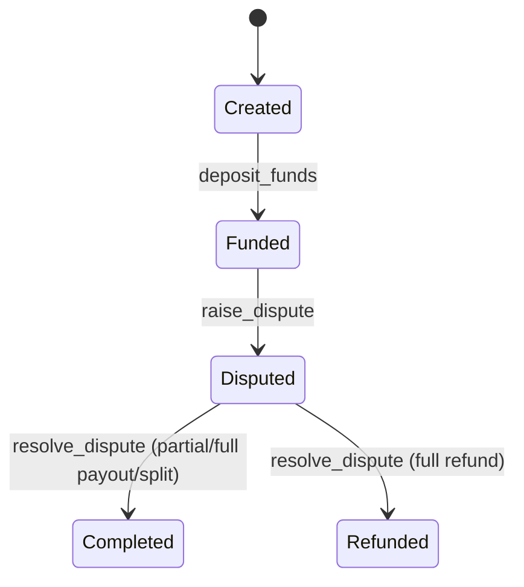

# Dispute Resolution

## Overview

The Talenttrust Escrow contract provides a comprehensive dispute resolution mechanism that allows contract parties (client and freelancer) to escalate disagreements to an assigned arbiter. When a dispute arises, the arbiter can decide how to fairly distribute the remaining escrowed funds between the parties.

## Architecture

### Key Components

1. **Dispute Status** - Contracts transition to `Disputed` state when a party raises a dispute
2. **Arbiter Role** - A neutral third party assigned during contract creation who resolves disputes
3. **Resolution Types** - Four resolution options: FullRefund, PartialRefund, FullPayout, Split
4. **Accounting Integrity** - All resolutions maintain the invariant: `released + refunded = total_deposited`

## Dispute Lifecycle

```
Created → Funded → [work happens] → Dispute Raised → Disputed → Dispute Resolved → Completed/Refunded
```

### State Transitions



## Entrypoints

### `raise_dispute`

Opens a dispute on a funded or partially funded contract.

**Signature:**
```rust
pub fn raise_dispute(env: Env, contract_id: u32, caller: Address) -> bool
```

**Parameters:**
- `contract_id` - The contract to dispute
- `caller` - Address of the party raising the dispute (must be client or freelancer)

**Requirements:**
- ✅ Caller must be authenticated
- ✅ Caller must be either the client or freelancer
- ✅ Contract must have an assigned arbiter
- ✅ Contract must be in `Funded` or `PartiallyFunded` state
- ✅ Contract must not be paused or under emergency controls
- ✅ Contract must not be finalized

**Effects:**
- Contract status → `Disputed`
- Milestone releases are blocked
- Emits `(dispute, opened)` event

**Error Codes:**
- `UnauthorizedRole` - Caller is not client or freelancer
- `ArbiterRequired` - No arbiter assigned to contract
- `InvalidState` - Contract not in disputable state
- `ContractPaused` - Pause or emergency controls active
- `AlreadyFinalized` - Contract has been finalized

**Example:**
```rust
// Client raises dispute
let contract_id = 42;
let result = escrow_client.raise_dispute(&contract_id, &client_address);
assert!(result);
```

### `resolve_dispute`

Applies the arbiter's resolution decision to distribute remaining funds.

**Signature:**
```rust
pub fn resolve_dispute(
    env: Env,
    contract_id: u32,
    arbiter: Address,
    resolution: DisputeResolution,
) -> bool
```

**Parameters:**
- `contract_id` - The disputed contract
- `arbiter` - Address of the assigned arbiter (must match contract's arbiter)
- `resolution` - The resolution decision (see Resolution Types below)

**Requirements:**
- ✅ Arbiter must be authenticated
- ✅ Arbiter must match contract's assigned arbiter
- ✅ Contract must be in `Disputed` state
- ✅ Resolution amounts must match available balance (for Split)
- ✅ Contract must not be paused or under emergency controls
- ✅ Contract must not be finalized

**Effects:**
- Updates `released_amount` and/or `refunded_amount`
- Sets final status (`Completed` or `Refunded`)
- Emits `(dispute, resolved)` event with resolution code

**Error Codes:**
- `UnauthorizedRole` - Caller is not the assigned arbiter
- `InvalidStatusTransition` - Contract is not in Disputed state
- `InvalidDisputeSplit` - Split amounts don't match available balance or are negative
- `AccountingInvariantViolated` - Accounting state is inconsistent
- `PotentialOverflow` - Amount calculations would overflow
- `ContractPaused` - Pause or emergency controls active
- `AlreadyFinalized` - Contract has been finalized

**Example:**
```rust
// Arbiter resolves with partial refund
let resolution = DisputeResolution::PartialRefund;
let result = escrow_client.resolve_dispute(&contract_id, &arbiter_address, &resolution);
assert!(result);
```

## Resolution Types

### 1. FullRefund

Refunds all remaining escrowed funds to the client.

**Formula:**
```
client_payout = available_balance
freelancer_payout = 0
final_status = Refunded
```

**Use Case:** Work was not performed or grossly inadequate.

**Example:**
```rust
let resolution = DisputeResolution::FullRefund;
// If available balance is 1000:
// → client gets 1000 refunded
// → freelancer gets 0 released
// → status: Refunded
```

### 2. PartialRefund

Refunds 70% of remaining balance to client, releases 30% to freelancer.

**Formula:**
```
freelancer_payout = available_balance * 30 / 100
client_payout = available_balance - freelancer_payout
final_status = Completed
```

**Use Case:** Work was partially completed but unsatisfactory.

**Example:**
```rust
let resolution = DisputeResolution::PartialRefund;
// If available balance is 1000:
// → client gets 700 refunded
// → freelancer gets 300 released
// → status: Completed
```

### 3. FullPayout

Releases all remaining escrowed funds to the freelancer.

**Formula:**
```
client_payout = 0
freelancer_payout = available_balance
final_status = Completed
```

**Use Case:** Work was completed satisfactorily despite dispute.

**Example:**
```rust
let resolution = DisputeResolution::FullPayout;
// If available balance is 1000:
// → client gets 0 refunded
// → freelancer gets 1000 released
// → status: Completed
```

### 4. Split(client_amount, freelancer_amount)

Applies a custom split of the remaining balance.

**Formula:**
```
client_payout = client_amount
freelancer_payout = freelancer_amount
final_status = Completed | Refunded (based on amounts)

Validation:
  client_amount + freelancer_amount = available_balance
  client_amount >= 0
  freelancer_amount >= 0
```

**Use Case:** Custom resolution based on evidence and arbitration.

**Example:**
```rust
let resolution = DisputeResolution::Split(600, 400);
// If available balance is 1000:
// → client gets 600 refunded
// → freelancer gets 400 released
// → status: Completed
```

## Accounting & Invariants

### Core Invariant

At all times during and after dispute resolution:
```
released_amount + refunded_amount = total_deposited
```

### Available Balance Calculation

The available balance for dispute resolution is:
```
available = funded_amount - released_amount - refunded_amount
```

This represents funds that:
- Have been deposited
- Have NOT been released to freelancer
- Have NOT been refunded to client

### Example Scenario

```
Initial State:
  total_deposited = 1000
  funded_amount = 1000
  released_amount = 0
  refunded_amount = 0
  available = 1000

After Releasing Milestone (300):
  released_amount = 300
  refunded_amount = 0
  available = 700

After Dispute Resolution (Split: 400 refund, 300 release):
  released_amount = 600 (300 + 300)
  refunded_amount = 400
  available = 0

Invariant Check:
  released (600) + refunded (400) = total_deposited (1000) ✓
```

## Security Considerations

### Access Control

1. **Raise Dispute**
   - Only client or freelancer can raise
   - Arbiter assignment is mandatory
   - Authentication required

2. **Resolve Dispute**
   - Only assigned arbiter can resolve
   - Cannot be called by client, freelancer, or third parties
   - Authentication required

### State Protection

1. **Dispute State**
   - Once disputed, milestone releases are blocked
   - Only arbiter resolution can change state
   - Cannot be disputed twice

2. **Pause Controls**
   - Pause blocks both raise and resolve
   - Emergency pause takes precedence
   - Cannot bypass through dispute mechanism

3. **Finalization**
   - Finalized contracts cannot be disputed
   - Dispute resolution is blocked if finalized
   - Provides immutability guarantees

### Amount Validation

1. **Split Validation**
   - Amounts must be non-negative
   - Sum must exactly match available balance
   - Overflow protection on all calculations

2. **Accounting Checks**
   - Invariant validation before and after
   - `AccountingInvariantViolated` error if inconsistent
   - `PotentialOverflow` error if risk detected

## Events

### Dispute Opened Event

**Topics:** `(dispute, opened)`  
**Data:** `(contract_id, caller_address)`

Emitted when a party successfully raises a dispute.

### Dispute Resolved Event

**Topics:** `(dispute, resolved)`  
**Data:** `(contract_id, resolution_code)`

Emitted when an arbiter successfully resolves a dispute.

**Resolution Codes:**
- `0` = FullRefund
- `1` = PartialRefund
- `2` = FullPayout
- `3` = Split

## Integration Examples

### Scenario 1: Client Disputes Incomplete Work

```rust
// Setup
let contract_id = escrow.create_contract(
    &client,
    &freelancer,
    &Some(arbiter),
    &vec![&env, 500, 300, 200],
    &ReleaseAuthorization::ClientOnly,
);
escrow.deposit_funds(&contract_id, &client, &1000);

// First milestone released
escrow.approve_milestone_release(&contract_id, &client, &0);
escrow.release_milestone(&contract_id, &client, &0);
// released_amount = 500, available = 500

// Client raises dispute
escrow.raise_dispute(&contract_id, &client);

// Arbiter determines 60/40 split is fair
escrow.resolve_dispute(&contract_id, &arbiter, &DisputeResolution::Split(300, 200));

// Final state:
// released_amount = 700 (500 + 200)
// refunded_amount = 300
// status = Completed
```

### Scenario 2: Freelancer Disputes Non-Payment

```rust
// Setup contract
let contract_id = escrow.create_contract(...);
escrow.deposit_funds(&contract_id, &client, &1000);

// Work completed but client won't approve
// Freelancer raises dispute
escrow.raise_dispute(&contract_id, &freelancer);

// Arbiter reviews evidence, awards full payment
escrow.resolve_dispute(&contract_id, &arbiter, &DisputeResolution::FullPayout);

// Final state:
// released_amount = 1000
// refunded_amount = 0
// status = Completed
```

### Scenario 3: Mutual Dissatisfaction

```rust
// Setup contract
let contract_id = escrow.create_contract(...);
escrow.deposit_funds(&contract_id, &client, &1000);

// Client raises dispute over quality
escrow.raise_dispute(&contract_id, &client);

// Arbiter determines partial refund is appropriate
escrow.resolve_dispute(&contract_id, &arbiter, &DisputeResolution::PartialRefund);

// Final state:
// released_amount = 300 (30% to freelancer)
// refunded_amount = 700 (70% to client)
// status = Completed
```

## Testing

The dispute resolution module includes comprehensive test coverage:

### Test Categories

1. **Access Control Tests**
   - `client_can_raise_dispute_on_funded_contract`
   - `freelancer_can_raise_dispute_on_funded_contract`
   - `raise_dispute_requires_contract_party`
   - `raise_dispute_requires_assigned_arbiter`
   - `resolve_dispute_requires_assigned_arbiter`

2. **State Transition Tests**
   - `raise_dispute_rejects_completed_contract`
   - `resolve_dispute_rejects_non_disputed_contract`
   - `resolve_dispute_cannot_be_called_twice`

3. **Resolution Logic Tests**
   - `resolve_full_refund_marks_refunded_and_closes_accounting`
   - `resolve_full_payout_marks_completed_and_closes_accounting`
   - `resolve_partial_refund_applies_70_30_split`
   - `resolve_partial_refund_applies_to_remaining_balance`
   - `resolve_split_accepts_custom_amounts_that_match_available_balance`

4. **Validation Tests**
   - `resolve_split_rejects_invalid_totals`
   - `resolve_split_rejects_negative_amounts`
   - `dispute_accounting_invariants_hold`

5. **Control Flow Tests**
   - `pause_blocks_raise_dispute`
   - `pause_blocks_resolve_dispute`
   - `emergency_blocks_raise_and_resolve_dispute`

6. **Integration Tests**
   - `multiple_disputes_on_different_contracts`
   - `dispute_events_are_emitted`

### Running Tests

```bash
# Run all dispute tests
cargo test --package escrow --lib dispute

# Run specific test
cargo test --package escrow --lib dispute::client_can_raise_dispute_on_funded_contract

# Run with output
cargo test --package escrow --lib dispute -- --nocapture
```

## FAQ

### Q: Can a contract be disputed after completion?
**A:** No. Disputes can only be raised on contracts in `Funded` or `PartiallyFunded` state. Once a contract reaches `Completed`, `Refunded`, or `Cancelled` status, it cannot be disputed.

### Q: What happens if no arbiter is assigned?
**A:** The `raise_dispute` call will fail with `ArbiterRequired` error. Contracts without arbiters cannot use the dispute mechanism.

### Q: Can the client or freelancer resolve their own dispute?
**A:** No. Only the assigned arbiter can call `resolve_dispute`. This ensures neutral third-party resolution.

### Q: What if the dispute resolution amounts don't match the available balance?
**A:** The `resolve_dispute` call will fail with `InvalidDisputeSplit` error. For `Split` resolutions, the sum of client and freelancer amounts must exactly equal the available balance.

### Q: Can a dispute be raised multiple times?
**A:** No. Once a contract is in `Disputed` state, it cannot be disputed again. The arbiter must resolve the dispute before any other actions.

### Q: How are protocol fees handled in disputes?
**A:** Protocol fees are calculated and accumulated during regular milestone releases. Dispute resolutions do not trigger additional protocol fees—they only distribute already-escrowed funds.

### Q: What happens to pending milestone approvals when a dispute is raised?
**A:** Milestone releases are blocked while in `Disputed` state. Any pending approvals remain but cannot be used to release milestones until the dispute is resolved.

### Q: Can pause controls be used to manipulate dispute outcomes?
**A:** No. Pause blocks both `raise_dispute` and `resolve_dispute`. It cannot be used selectively to prevent one party from acting while allowing the other.

## Related Documentation

- [Release Authorization](./release-authorization.md) - Milestone approval and release mechanisms
- [Pause Controls](./pause-controls.md) - Emergency pause and contract suspension
- [Finalization](./finalization.md) - Immutable contract close records
- [Client Migration](./client-migration.md) - Client address migration during active contracts

## Changelog

### v0.1.0 (Current)
- ✅ Initial implementation of `raise_dispute` entrypoint
- ✅ Initial implementation of `resolve_dispute` entrypoint
- ✅ Four resolution types: FullRefund, PartialRefund, FullPayout, Split
- ✅ Accounting invariant protection
- ✅ Pause and emergency control integration
- ✅ Comprehensive test coverage (20+ tests)
- ✅ Event emission for indexing

### Planned Enhancements
- 🔄 Dispute evidence attachment mechanism
- 🔄 Multi-phase arbitration workflow
- 🔄 Appeal process for dispute resolutions
- 🔄 Time-based automatic resolutions
- 🔄 Reputation impact on arbiter decisions
