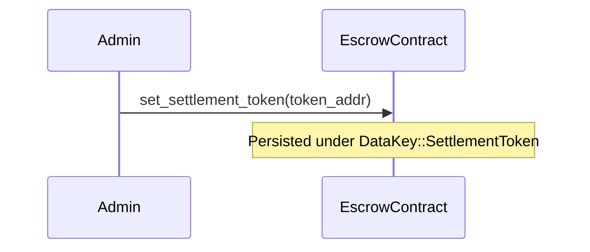
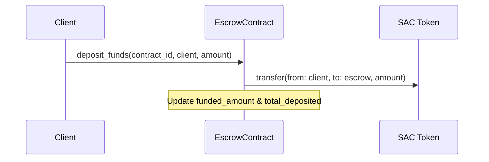
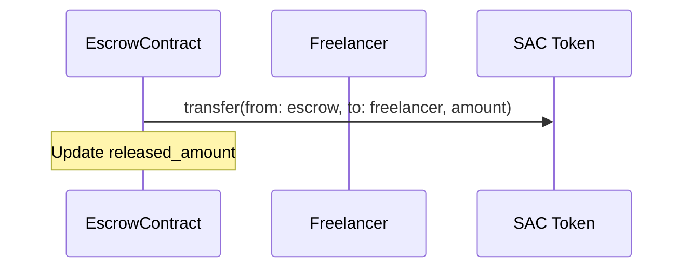
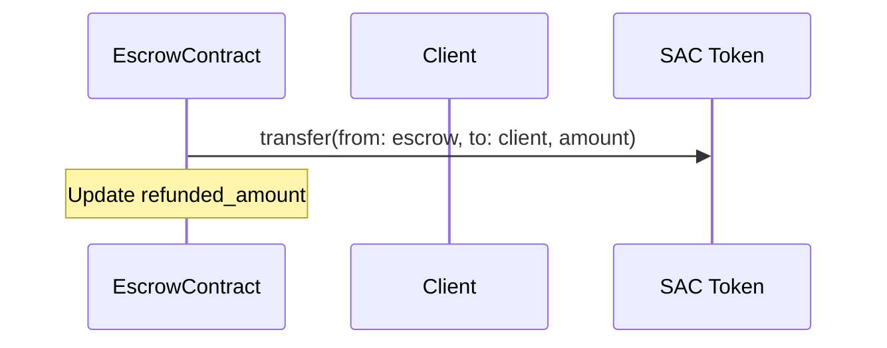

# Escrow Settlement Token Flow

This document details the design, life cycle, and security model of the on-chain settlement token transfers implemented for the TalentTrust Escrow contract.

## Overview

Historically, the Escrow contract only tracked milestone funding state using integer counters, without performing real on-chain token moves. This implementation updates the contract lifecycle to wire a configurable Stellar Asset Contract (SAC) token. 

All funds deposited are held directly in the contract address, and payouts (releases, refunds, and dispute resolutions) move these real token balances atomically with the contract state updates.

---

## Token Flow Lifecycle

### 1. Initialization & Configuration
- **Admin Setup**: The contract administrator configures the settlement token address using `set_settlement_token(token: Address)`.
- **Key Storage**: The token contract address is stored under the `DataKey::SettlementToken` persistent storage key with extended TTL.

### 2. Deposit Funds
- **Action**: Client calls `deposit_funds(contract_id, caller, amount)`.
- **Validation**: Verifies that the caller is indeed the client and validates the amount.
- **Token Transfer**: Pulls the specified amount of tokens from the client's wallet to the Escrow contract's address:
  `token::Client::transfer(&client, &escrow_address, &amount)`
- **Safety**: `client.require_auth()` ensures only the legitimate client can authorize the transfer.

### 3. Milestone Release
- **Action**: Authorized party (e.g. client) calls `release_milestone(contract_id, milestone_index, caller)`.
- **Validation**: Verifies that the milestone is approved, funded, and not already released or refunded.
- **Token Transfer**: Pushes the milestone amount from the contract address to the freelancer:
  `token::Client::transfer(&escrow_address, &freelancer, &milestone_amount)`
- **Error Handling**: Fails with `InsufficientEscrowBalance` if the contract does not hold enough tokens.

### 4. Milestone Refund
- **Action**: Client or arbiter initiates a refund request using `refund_unreleased_milestones(contract_id, milestone_indices)`.
- **Validation**: Verifies milestones are not already released/refunded.
- **Token Transfer**: Pushes the calculated refund sum from the contract address back to the client:
  `token::Client::transfer(&escrow_address, &client, &refund_amount)`
- **Error Handling**: Fails with `InsufficientEscrowBalance` if the contract balance is insufficient.

### 5. Dispute Resolution
- **Action**: Arbiter calls `resolve_dispute(contract_id, caller, resolution)`.
- **Validation**: Verifies caller is the arbiter and contract is in `Disputed` status.
- **Token Transfer**: Calculates payouts for both client and freelancer according to the resolution. Performs transfers atomically:
  - Transfers `freelancer_payout` to the freelancer.
  - Transfers `client_payout` to the client.
- **Error Handling**: Verifies the escrow balance before executing transfers, failing with `InsufficientEscrowBalance` if insufficient.

---

## Threat Model & Security Mitigations

| Threat | Mitigation |
|--------|------------|
| **Unauthorized Payouts / Theft** | Every transfer from the client's wallet requires explicit cryptographic authorization via `.require_auth()`. Contract-held payouts (release/refund/dispute) are strictly gated by access control roles stored in contract state. |
| **Double Payouts / Reentrancy** | Milestone state transitions are locked with boolean flags (`released` and `refunded`). Any attempt to release or refund a milestone twice will panic early. |
| **Fund Lock-up / Under-funded Transfers** | Added `InsufficientEscrowBalance` check to ensure the contract fails loudly before attempting to transfer more than its balance, keeping the state intact. |
| **Arithmetic Overflow/Underflow** | All balance calculations use safe arithmetic wrappers (`safe_add_amounts`, `safe_subtract_amounts`) preventing overflow exploits. |
